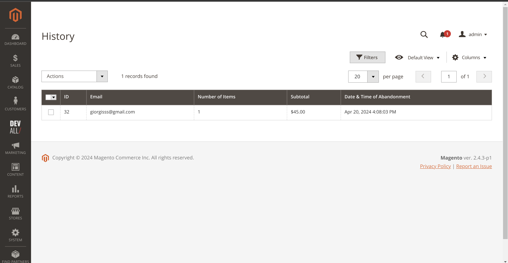

# DevAll_Abandoned

The `DevAll_Abandoned` module is a part of an e-commerce application designed to handle abandoned shopping carts. It monitors the state of a user's shopping cart and sends an email reminder to the customer if the cart is active but hasn't been updated for a certain period of time.

The module collects data about the cart, such as the customer's email, the total value of the cart, and the items in the cart. It then uses this data to generate a personalized email for the customer, which includes details about the items in the cart and the total value.

The `DevAll_Abandoned` module uses the Observer pattern to listen for events that indicate a cart may be abandoned. When such an event is detected, it triggers the email sending process.

This module is built using PHP and integrates with the existing e-commerce application's infrastructure, including its email system and database.

---



---

## Installation

1. Install the module via Composer by running the following command in the Magento 2 root directory:

   ```
   composer require developersalliance/module-abandoned
   ```

2. Run the Magento upgrade command to install the module:

   ```
   bin/magento setup:upgrade
   ```
---

## Features
- Real-time monitoring of the state of a user's shopping cart.
- Automated email reminders for customers with active carts that haven't been updated for a certain period of time.
- Personalized emails that include details about the items in the cart and the total value.
- Integration with the existing e-commerce application's infrastructure, including its email system and database.
- Exception and error handling for a smooth user experience.
- Periodic checks for and handling of abandoned carts through a cron job.


## License

This module is licensed under the [MIT License](LICENSE.txt).

---
